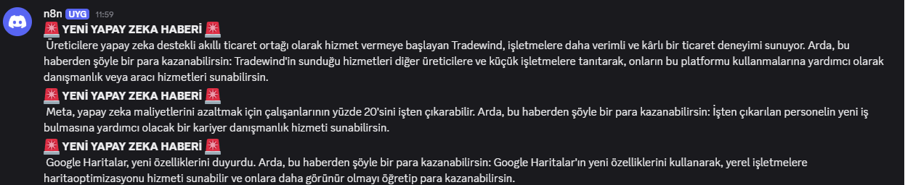

# AI News Profit Agent – n8n + Groq

RSS haberlerini çekip Groq'a soran, “Bu haberden para kazanmak için ne yapılabilir?” diye analiz yaptıran bir otomasyon.

## Ne Yapıyor?
1. Schedule Trigger ile düzenli RSS haber çekiyor  
2. Filtre ile alakalı haberleri seçiyor  
3. JavaScript ile veriyi temizliyor  
4. Groq LLM'e atıp fırsat analizi yaptırıyor  
5. Cevabı Discord'a gönderiyor  

Örnek soru: “Bu haberden para kazanma fırsatı var mı? Ne satabilirim / nasıl aksiyon alırım?”

## Teknolojiler
- n8n (workflow otomasyonu)  
- Groq (ücretsiz LLM modelleri: llama3 vb.)  
- RSS Feed + JavaScript parsing  
- Discord entegrasyonu  

## Kurulum
1. n8n cloud veya self-host kurun  
2. Workflow → Import from JSON → [ai-news-profit-agent.json](ai-news-profit-agent.json) dosyasını yükleyin  
3. Credential'ları doldurun:  
   - Groq API key (console.groq.com/keys – ücretsiz)  
   - Discord webhook URL  
4. Execute edin  

## Ekran Görüntüleri
  
  

## Gelecek Planlar
- Farklı RSS kaynakları ekleme  
- Hafıza (memory) ile önceki haberleri hatırlama  
- E-posta / Telegram entegrasyonu  
- Para kazanma fırsatlarını otomatik sınıflandırma  

Geri bildirimlerinizi bekliyorum! 🚀  

#AI #n8n #Groq #Automation #RPA #HaberAnalizi
